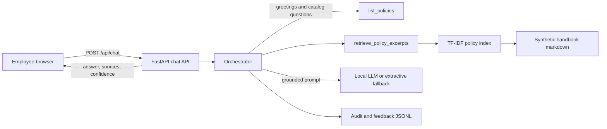

# Architecture

Harborline Guide is a single Python process. The browser talks to a FastAPI app, and that app is the only component that reads the handbook or calls a model.

## Request path

1. The UI sends `{ "message", "session_id" }` to `POST /api/chat`.
2. The session store keeps the conversation in memory and passes the recent turns forward.
3. The orchestrator picks a tool:
   - `list_policies` for a greeting or a "what can you answer?" question.
   - `retrieve_policy_excerpts` for a policy question. The query includes the previous user question when the new message has fewer than two specific terms, so "How many weeks is that?" can follow "What is parental leave?"
4. Retrieval ranks handbook chunks with TF-IDF cosine similarity and keeps the top four.
5. A coverage check refuses the question when the score is weak or the distinctive words in the question are missing from those chunks. The model is not called.
6. Otherwise the orchestrator builds a prompt that contains only those excerpts, the short conversation, and the rules in `app/prompts.py`.
7. The selected generator answers. If it times out, returns nothing, or is not installed, the orchestrator quotes the matching handbook sentences and marks the response `degraded`.
8. The response always includes the disclaimer, the tool name, a short explanation, and the excerpts with owner, effective date, and retrieval score.
9. An audit line is appended locally. Feedback from the UI is a separate JSONL file.

## Backends

| `LLM_BACKEND` | What runs | When to use it |
| --- | --- | --- |
| `auto` | Transformers if the library is installed, otherwise extractive quotes | Default |
| `extractive` | No generative model. Answers are selected handbook sentences | Clean laptop, tests, demos |
| `transformers` | Local Hugging Face model, default `google/flan-t5-small` | Generative answers with no API key |
| `ollama` | Local Ollama HTTP API | When a larger instruction model is already installed |

## How this would scale

The POC keeps the index, sessions, and logs on one machine because the handbook is a few dozen chunks and the user is the developer. The same boundaries scale without changing the contract:

- **Corpus.** Chunk and embed offline. Swap `PolicyIndex` for a vector database with metadata filters. Keep the coverage check and the citation payload.
- **Model.** Move generation behind the same `generate(prompt)` function, pointed at vLLM, Ollama, or an approved enterprise endpoint. Timeouts and the extractive fallback stay.
- **Users.** Replace the in-memory session store with a database keyed by authenticated user. Put the model behind a queue so one long generation cannot block the API workers.
- **Access control.** Filter chunks by the caller's groups before they enter the prompt. The model never sees a policy the user cannot open.
- **Governance.** Ship audit events to the company log platform, retain questions for a defined period, and put a person on the downvote queue. The summary endpoint would require an admin role; here it is open because the app has no accounts.

## What is intentionally out of process

There is no separate vector database, no login, and no streaming token channel. Those are named in [DESIGN_RATIONALE.md](DESIGN_RATIONALE.md) as follow-on work, not hidden dependencies.
